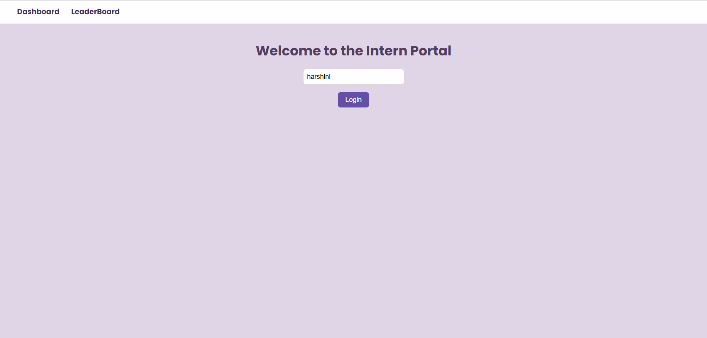
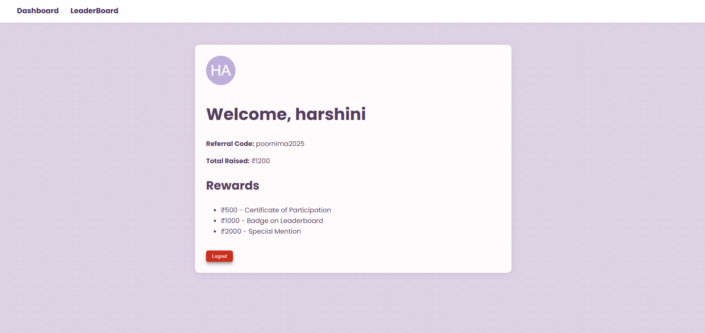
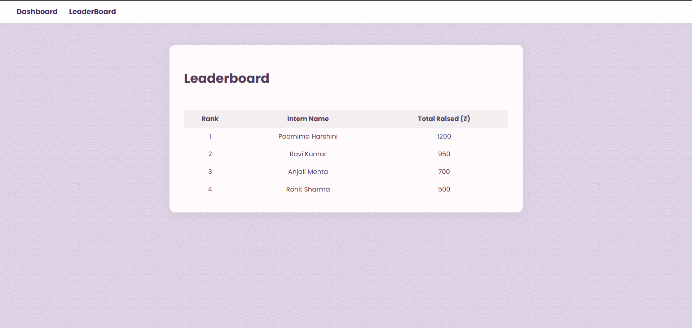

# Fundraising Intern Portal

This is my submission for the **Internship** task.  
The portal allows interns to view their referral code, total donations raised, unlocked rewards, and check a leaderboard.

---

| Login Page | Dashboard | Leaderboard |
|------------|-----------|-------------|
|  |  |  |

---
## demo link

Front End: https://fundraising-intern-portal-olive.vercel.app/
Back End : https://fundraising-intern-portal-t78v.onrender.com/

---

## Tech Stack

- **Frontend:** React, React Router, Framer Motion  
- **Backend:** Node.js, Express  
- **Styling:** Responsive CSS with custom fonts and textures  
- **Avatar Generator:** Dicebear Avatars  
- **Version Control:** Git & GitHub  

---

## Folder Structure

```
fundraising-intern-portal/
├── client/          # React Frontend
│   ├── src/
│   └── public/
├── server/          # Node/Express Backend
│   └── index.js
└── README.md
```

---

## How to Run Locally

### 1. Clone the Repository

```bash
git clone https://github.com/Harshini2410/fundraising-intern-portal.git
cd fundraising-intern-portal
```

### 2. Start the Backend Server

```bash
cd server
npm install
node index.js
```

> Backend runs at: `http://localhost:5000`

### 3. Start the Frontend React App

```bash
cd ../client
npm install
npm start
```

> Frontend runs at: `http://localhost:3000`

---

## Features

- Dummy login page (only name required)
- Personalized dashboard with:
  - Intern name
  - Referral code
  - Total donations raised
  - Rewards section
  - Avatar display
- Leaderboard page (dummy backend data)
- Framer Motion animations for smooth UI
- Mobile-first responsive layout
- Logout button (clears localStorage session)
- Minimal and clean UI with soft background texture

---

## Feedback

I really enjoyed building this project. I focused on:
- Clean and modern user interface
- Responsive and accessible layout
- Simple animations for smoother user experience

---

## Author

**Poornima harshini**  
Mail Id:  [npoornimaharshini2003@gmail.com](mailto:npoornimaharshini2003@gmail.com)  
GitHub :  [GitHub – Harshini2410](https://github.com/Harshini2410)
